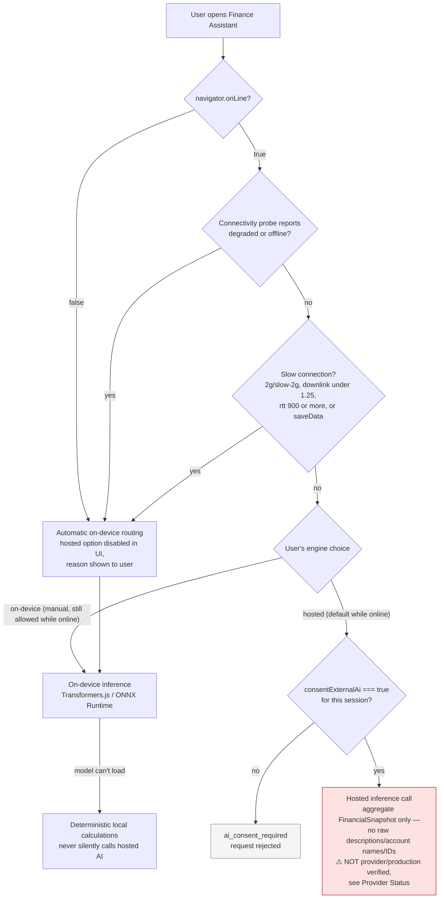

# Hugging Face financial intelligence

The application uses Hugging Face as an optional, server-side reasoning layer on top of deterministic financial calculations.

## Architecture

1. The browser or trusted backend builds an aggregated `FinancialSnapshot`.
2. Raw merchant descriptions, account names, transaction IDs, and credentials are excluded from the model prompt.
3. The server calls the Hugging Face OpenAI-compatible router with `HF_TOKEN` stored only in server configuration.
4. The model must return structured JSON.
5. The application validates signal types, evidence, confidence, text lengths, and approval requirements.
6. Invalid output, timeouts, provider errors, or unavailable models fall back to deterministic rules.

## Connectivity-aware routing

The steps above only run when the Finance Assistant has actually decided to call the hosted model. Hosted reasoning is the default while online, but the app automatically routes to the on-device model when offline, when the connection is reported degraded, or when the Network Information API reports a materially slow connection — and it never silently falls back to hosted AI if the on-device model can't load.



Source: [`diagrams/ai-assistant-routing.mmd`](../diagrams/ai-assistant-routing.mmd).

## Default model

`Qwen/Qwen3-4B-Thinking-2507:fastest` is the default reasoning model. The model ID is configurable so production deployments can pin an approved model or use a different Hugging Face Inference Provider policy.

## Required environment

```bash
HF_TOKEN=hf_...
```

Never expose `HF_TOKEN` through Vite variables or client-side bundles.

## Safety and quality controls

- recommendations never execute financial actions;
- every suggested action remains approval-gated;
- only predefined signal types are accepted;
- confidence is clamped to the range 0–1;
- model output cannot override deterministic balances or transaction totals;
- malformed or unavailable inference degrades to a deterministic result;
- production rollout should log latency, fallback rate, schema failures, model ID, and user feedback without logging raw financial descriptions.

## Production follow-up

- expose the transport through an authenticated server endpoint;
- add per-user rate limits and request budgets;
- pin an evaluated model revision;
- run the frozen AI evaluation suite against German and English financial scenarios;
- add model drift, fallback-rate, and hallucination alerts;
- require explicit user consent before any aggregated financial snapshot is sent to an external inference provider.
