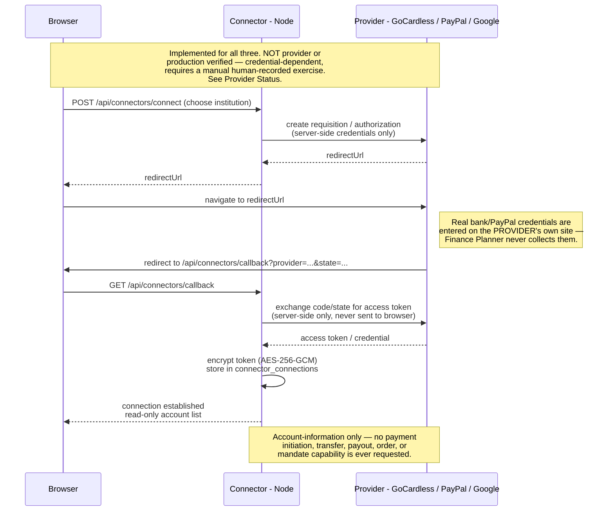

# Read-only open-banking architecture

Finance Planner is an account-information application. It does not initiate payments, transfers, payouts, orders, mandates, or other money movement.

## Provider contract

`server/src/providers.js` exposes a generic `OpenBankingProvider` contract and `OpenBankingProviderRegistry`.

A provider adapter must declare read-only capabilities and implement:

- configuration detection;
- provider-hosted consent or owner-account connection setup;
- account, balance, and transaction synchronization;
- normalized reconciliation output.

The server dispatches setup, callback, synchronization, disconnection, health reporting, metrics, and optional webhook handling through the registry rather than provider-specific branches.

The registry currently includes:

- `gocardless`: PSD2 account-information adapter;
- `paypal`: PayPal reporting adapter, with owner-account and partner modes;
- `finapi`: explicit unavailable placeholder until a real adapter is implemented and tested.

A replacement licensed PSD2 AISP can be added as another adapter without changing the deterministic banking-domain rules. File-backed account deletion and operational metrics also accept registered provider identifiers without maintaining a separate provider whitelist.

**Implemented, not provider or production verified.** The flow below is correct for GoCardless, PayPal, and Google subscriptions alike — the choreography and the security invariant (credentials/tokens only ever touch the server) are real and code-reviewed, but no completed live consent→sync→disconnect cycle against a real provider is evidenced in-repo; see `docs/issue-105-live-verification.md` and the project's Provider Status notes.

**Enable Banking's redirect_url differs from the diagram below in one respect** (fixed 2026-08-21 after a live `REDIRECT_URI_NOT_ALLOWED` rejection from the real sandbox): its Control Panel validates the submitted redirect_url as an exact, bare string with no query parameters, so it receives a canonical `{APP_ORIGIN}/api/connectors/callback` with no `?provider=`/`?state=` baked in (`providers.js`'s `canonicalCallbackUrl()`) — the server derives which provider a callback belongs to from the verified `state` payload itself instead. GoCardless, PayPal, and Google subscriptions are unaffected and still match the diagram exactly.

Source: [`diagrams/provider-connection-flow.mmd`](../diagrams/provider-connection-flow.mmd).

## COBOL boundary

GnuCOBOL is authoritative for banking-domain decisions:

- provider account-type normalization;
- fixed-point provider amount conversion;
- provider consent-state classification;
- read-only scope enforcement;
- provider account/transaction reconciliation and duplicate-count acceptance;
- credit-card normalization.

Node.js is limited to generic HTTP/TLS transport, OAuth redirects, bounded provider JSON parsing, encrypted persistence, sessions, retry orchestration, user authorization, and operational controls. Node may collect provider rows and count unique identifiers, but the COBOL core decides whether the resulting account, transaction, duplicate, and date-window invariants are acceptable.

Provider responses are not accepted into Finance Planner state until the COBOL banking core validates the relevant financial, consent, scope, and reconciliation semantics. Provider banking operations do not use JavaScript financial fallbacks.

Production images set `COBOL_BANKING_REQUIRED=true`, so these decisions fail closed if the compiled banking core is unavailable.

## Readiness semantics

- `/health/ready` reports core application readiness only. Automatic bank monitoring is never a core readiness dependency, including when optional provider configuration is incomplete.
- `/health/bank` independently reports automatic account-information capability and returns unavailable until at least one supported read-only provider is correctly configured.
- Missing or invalid provider credentials are a bank-capability limitation, not a core application outage.

## PayPal modes

`PAYPAL_CONNECTION_MODE=owner` monitors the PayPal Business account associated with the configured REST application through reporting APIs. It verifies reporting access during setup, reads the EUR account balance from the balance-reporting endpoint, and requests transaction information plus balance-affecting records only. It does not require partner onboarding and does not expose payment APIs.

Owner mode must also set `PAYPAL_OWNER_USER_ID` to the exact authenticated Finance Planner user ID permitted to access that application-owned PayPal account. Setup and every synchronization fail closed for all other users, preventing one deployment's PayPal REST credentials from exposing the same account to unrelated Finance Planner accounts.

`PAYPAL_CONNECTION_MODE=partner` retains the provider-hosted partner onboarding path and requires `PAYPAL_PARTNER_MERCHANT_ID` plus webhook verification.

When the mode variable is omitted, Finance Planner selects partner mode only when a partner merchant ID is present; otherwise it selects owner mode, which remains unavailable until `PAYPAL_OWNER_USER_ID` is configured.

## Security invariant

Every registered provider reports these capabilities as false:

- payment initiation;
- transfers;
- payouts;
- orders;
- mandates.

The COBOL core separately rejects provider scope strings containing money-movement terms.
